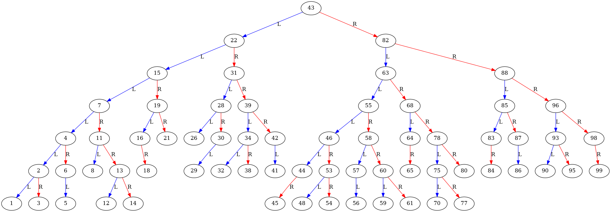

# AVL-Tree C++ implementation

### Build

```bash
g++ main.cpp -o avl
```

### Create random tree

```bash
./avl
```

### Visualization tree

```bash
# sudo apt install graphviz 
dot -Tpng example.dot -o example.png && open example.png
```

### Example



